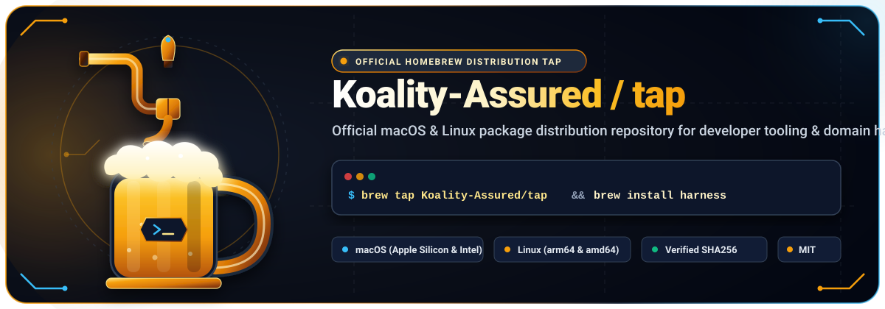
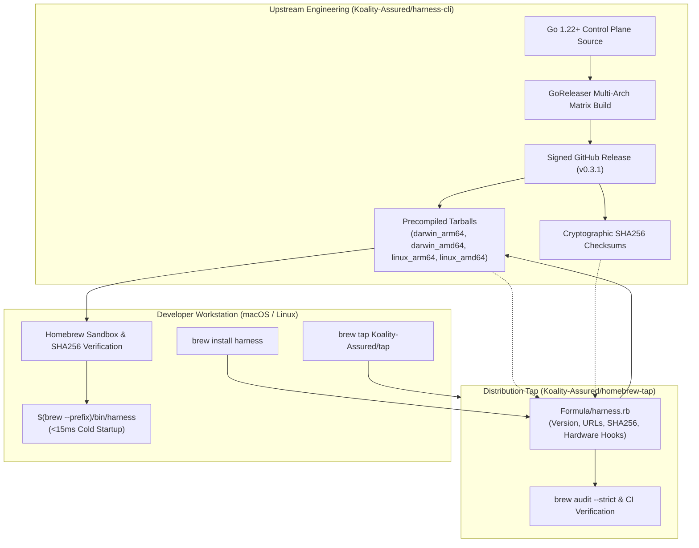

<div align="center">



<br/><br/>


# Koality-Assured Homebrew Tap (`homebrew-tap`)

**Official macOS and Linux package distribution repository for Koality-Assured developer tooling and domain harnesses.**

[](https://brew.sh)
[](LICENSE)
[](Formula/)
[]()
[](https://conventionalcommits.org)

<br/>

</div>

---

## Overview

This repository is the official third-party [Homebrew](https://brew.sh) tap for the **Koality-Assured** ecosystem. It provides verified formula definitions to seamlessly install, update, and manage high-performance compiled developer tooling, domain harnesses, and autonomous execution control planes on macOS and Linux.

Every formula in this tap delivers pre-compiled, optimized binaries with zero runtime interpreter overhead, guaranteed cryptographic checksums (`SHA256`), and multi-architecture support across Apple Silicon (`arm64`), Intel (`amd64`), and Linux systems.

---

## Quick Start

### 1. Add the Tap

Add the Koality-Assured tap to your local Homebrew installation:

```bash
brew tap Koality-Assured/tap
```

### 2. Install Tooling

Install the unified `harness` CLI:

```bash
brew install harness
```

Alternatively, install directly in a single command without explicitly pre-tapping:

```bash
brew install Koality-Assured/tap/harness
```

### 3. Verify Installation

Verify that the binary was installed into your Homebrew binary prefix (`/opt/homebrew/bin` on Apple Silicon, `/usr/local/bin` on Intel macOS, or `/home/linuxbrew/.linuxbrew/bin` on Linux):

```bash
harness --version
harness --help
```

---

## Updating & Upgrading

Keep your installed formulae synchronized with the latest upstream releases:

```bash
# Update Homebrew formulae indices
brew update

# Upgrade harness to the latest release
brew upgrade harness

# Check installed version and formula provenance
brew info Koality-Assured/tap/harness
```

To reinstall or repair a local installation:

```bash
brew reinstall harness
```

---

## Available Formulae

| Formula | Description | Current Version | Platforms | Upstream Repository | License |
| :--- | :--- | :---: | :---: | :---: | :---: |
| [`Formula/harness.rb`](Formula/harness.rb) | Unified Harness CLI Control Plane for domain harnesses, worktree isolation, credential vaults, and agent protocols | `v0.3.1` | macOS (`arm64`, `amd64`)<br/>Linux (`arm64`, `amd64`) | [Koality-Assured/harness-cli](https://github.com/Koality-Assured/harness-cli) | [MIT](LICENSE) |

---

## Architecture & Distribution Pipeline

The diagram below details the release and delivery lifecycle from upstream binary compilation to developer installation via this tap:



---

## Platform Support Matrix

Formulae in this tap are continuously verified across the following environments:

| Operating System | Architecture | Binary Variant | Status |
| :--- | :--- | :--- | :---: |
| **macOS 12+** (Monterey, Ventura, Sonoma, Sequoia) | Apple Silicon (`arm64` / M1–M4) | `darwin_arm64` | Verified |
| **macOS 12+** (Monterey, Ventura, Sonoma, Sequoia) | Intel (`x86_64` / `amd64`) | `darwin_amd64` | Verified |
| **Linux** (Ubuntu, Debian, Fedora, Arch, CentOS) | ARM64 (`aarch64`) | `linux_arm64` | Verified |
| **Linux** (Ubuntu, Debian, Fedora, Arch, CentOS) | x86_64 (`amd64`) | `linux_amd64` | Verified |

---

## Formula Audit & Testing Guide

For contributors and maintainers updating or testing formula definitions in this tap:

### Syntax & Style Validation

Validate Ruby syntax and Homebrew style guidelines:

```bash
# Validate formula style rules
brew style Formula/harness.rb

# Audit formula for Homebrew standards and live asset availability
brew audit --strict --online Koality-Assured/tap/harness
```

### Installation & Test Block Execution

Execute the formula's embedded `test do ... end` block in a clean Homebrew sandbox:

```bash
# Test the installed formula
brew test Koality-Assured/tap/harness

# Reinstall with verbose debugging output
brew install --verbose --debug Koality-Assured/tap/harness
```

### Bumping Upstream Versions

When a new upstream release is published on `Koality-Assured/harness-cli`:

1. Download or query the newly generated tarballs to compute their SHA256 checksums:
   ```bash
   curl -sL https://github.com/Koality-Assured/harness-cli/releases/download/v${VERSION}/harness_${VERSION}_darwin_arm64.tar.gz | shasum -a 256
   curl -sL https://github.com/Koality-Assured/harness-cli/releases/download/v${VERSION}/harness_${VERSION}_darwin_amd64.tar.gz | shasum -a 256
   curl -sL https://github.com/Koality-Assured/harness-cli/releases/download/v${VERSION}/harness_${VERSION}_linux_arm64.tar.gz | shasum -a 256
   curl -sL https://github.com/Koality-Assured/harness-cli/releases/download/v${VERSION}/harness_${VERSION}_linux_amd64.tar.gz | shasum -a 256
   ```
2. Update `version` and the respective `sha256` hashes in [`Formula/harness.rb`](Formula/harness.rb).
3. Test locally using `brew install --build-from-source` or `brew test`.
4. Submit a pull request following [Conventional Commits](https://conventionalcommits.org) (e.g. `feat(formula): bump harness to v0.3.2`).

---

## Troubleshooting

### Clearing Stale Caches

If Homebrew reports a checksum mismatch after an upstream re-release or network interruption, purge the downloaded cache:

```bash
brew cleanup -s harness
rm -rf $(brew --cache)/downloads/*harness*
brew install harness
```

### Untapping and Re-tapping

If git references become detached or out of sync:

```bash
brew untap Koality-Assured/tap
brew tap Koality-Assured/tap
```

### Verifying Binary PATH

Ensure your shell configuration includes Homebrew's binary directory:

```bash
# macOS Apple Silicon
export PATH="/opt/homebrew/bin:$PATH"

# macOS Intel
export PATH="/usr/local/bin:$PATH"

# Linux Homebrew
eval "$(/home/linuxbrew/.linuxbrew/bin/brew shellenv)"
```

---

## Contributing

Contributions, bug reports, and formula enhancements are welcome! Please follow these guidelines:

1. Create a feature branch: `git checkout -b feat/formula-improvement`.
2. Follow [Conventional Commits](https://conventionalcommits.org) for all commit messages (e.g., `feat(formula): ...`, `fix(formula): ...`, `docs: ...`).
3. Run `brew audit --strict` prior to submitting your pull request.

---

## License

This repository and its formula definitions are licensed under the [MIT License](LICENSE).
Upstream tooling binaries maintain their respective licenses as noted in their formula specifications.
